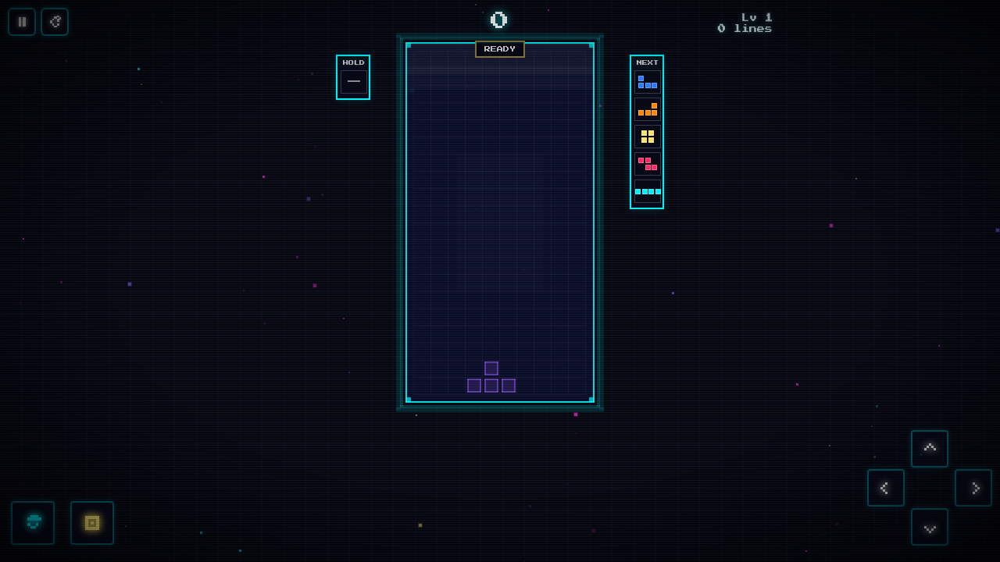
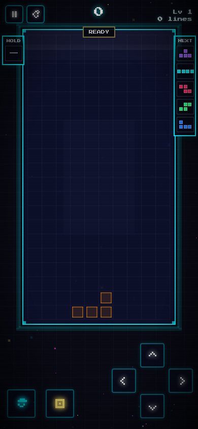

<div align="center">



# Neon Tetris

A Tetris clone that got out of hand.

[](https://tetris.pixpress.art)
&nbsp;
[](LICENSE)

</div>

---

Cyberpunk-themed Tetris with CRT scanlines, chromatic aberration, particle explosions, and a synthesized soundtrack. No audio files — every sound is generated on the fly via Web Audio API.

T-spin detection, perfect clear, combo chains. Ghost piece. Works on mobile.

<div align="center">

</div>

---

## Controls

| Key | Action |
|-----|--------|
| `← →` | Move |
| `↑` / `X` | Rotate |
| `↓` | Soft drop |
| `Space` | Hard drop |
| `C` / `Shift` | Hold |
| `P` / `Esc` | Pause |

On mobile, use the on-screen D-pad.

---

## Stack

Phaser 3 · TypeScript · Vite · Web Audio API · PWA

---

## Run locally

```bash
git clone https://github.com/DuongStark/Tetris.git
cd Tetris
npm install
npm run dev
```

---

## Scoring

| Move | Points |
|------|--------|
| Single | 100 × level |
| Double | 300 × level |
| Triple | 500 × level |
| Tetris | 800 × level |
| T-Spin | 400–1600 × level |
| Perfect Clear | 1000 × level |

---

MIT
